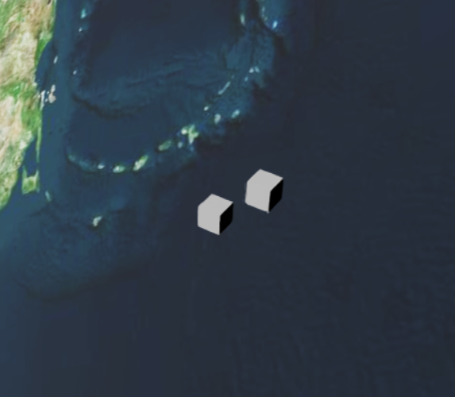

# Orbit Control Framework

Two-extension Isaac Sim framework for physically accurate two-body orbital mechanics with real-time control. It works for more than two orbiting bodies, but this extension is mainly for two body orbits. 



## Architecture

```
orbit_framework/
├── exts/
│   ├── com.ov.core/          # Physics engine + USD persistence
│   │   └── com/ov/core/
│   │       ├── extension.py       # IExt, update loop, USD transform writes
│   │       ├── service.py         # OrbitService singleton, OrbitBody dataclass
│   │       ├── orbit_math.py      # TwoBodyRK4, FixedStepClock, vector math
│   │       └── usd_persistence.py # orbit: namespace attribute read/write
│   └── com.ov.controls/      # UI + visualization
│       └── com/ov/controls/
│           ├── extension.py       # IExt, context menu, viz update loop
│           ├── ui.py              # omni.ui control panel
│           └── visualizer.py      # BasisCurves orbit path rendering
```

### Extension dependency

`com.ov.controls` depends on `com.ov.core`. Load order: core first, controls second. Both must be disabled/re-enabled in reverse order when reloading.

### Simulation model

Each `OrbitBody` integrates the two-body equation of motion in the **attractor-relative frame** using 4th-order Runge-Kutta (`TwoBodyRK4.rk4_step`). World position is computed each frame as `attractor_world + body.r`. The attractor itself is a passive USD prim — it has no orbit state unless explicitly registered as a body.

`FixedStepClock` accumulates wall-clock `dt` and fires fixed-step sub-steps, decoupling simulation frequency from render rate. Default `dt_sim = 1/120 s`.

### USD persistence

Body state is written as custom attributes in the `orbit:` namespace on each body prim (e.g. `orbit:r`, `orbit:v`, `orbit:control_mode`). State saves automatically with the `.usd` file and is restored on stage open via `OrbitService.restore_from_stage()`.

`_pre_dock_r` / `_pre_dock_v` are **not** persisted — undocking after a reload falls back to current position with zero velocity.

---

## Installation

1. Clone the repo:
   ```bash
   git clone <repo-url> ~/orbit_framework
   ```

2. Register both extensions in Isaac Sim Extension Manager → **Add** path:
   ```
   /home/<user>/orbit_framework/exts
   ```

3. Enable extensions in order:
   - `com.ov.core`
   - `com.ov.controls`

4. Isaac Sim 5.1 required. No external Python dependencies beyond the Isaac Sim environment.

---

## Usage

### Add a circular orbit body

In the **Orbit Controls** panel → *Add Circular Orbit Body*:

| Field | Description |
|---|---|
| Body prim path | USD path of the orbiting prim |
| Attractor prim path | USD path of the central body prim |
| mu | Gravitational parameter (m³/s² or scaled units) |
| dt_sim | Fixed integration timestep (s) |
| radius | Circular orbit radius from attractor center |
| plane | Orbital plane: `xy`, `xz`, or `yz` |

### Add a body via orbital elements

*Add Body via Orbital Elements* accepts classical elements:

| Field | Description |
|---|---|
| a | Semi-major axis |
| e | Eccentricity (0 ≤ e < 1) |
| inc | Inclination (degrees) |
| RAAN | Right ascension of ascending node (degrees) |
| arg periapsis | Argument of periapsis (degrees) |
| true anomaly | True anomaly at epoch (degrees) |

### Control modes

Each body has one of three control modes:

**`free`** — pure two-body gravity, no thrusters.

**`dock`** — hard constraint. Each tick: `b.r = target_offset`, `b.v = (0,0,0)`. Position is frozen at the specified attractor-relative offset. Pre-dock state (`r`, `v`) is saved on dock and restored on undock.

**`pd`** — PD controller applying thrust acceleration toward `target_offset` in the attractor-relative frame:
```
a = kp * (target_offset - r) + kd * (0 - v)
```
Clamped to `a_max` if set. Does not cancel orbital velocity — tune `kp`/`kd` relative to orbital period.

### Impulse

Applies an instantaneous Δv to body velocity:
```
b.v += dv
```
`+Prograde` / `-Prograde` buttons apply `±dv_y` using the current dv y field value.

### Orbit visualization

Enable **Show orbit paths** to render a `UsdGeom.BasisCurves` prim under `/OrbitViz/` for each body. The path is computed by forward-integrating one full orbital period from the current state. **Viz update interval** controls redraw frequency in frames.

---

## API Reference

### `OrbitService`

Singleton accessed via `get_orbit_service()`. Other extensions should import from `com.ov.core.service`.

```python
from com.ov.core.service import get_orbit_service
svc = get_orbit_service()
```

| Method | Description |
|---|---|
| `add_body_circular(prim_path, attractor_path, mu, dt_sim, radius, plane)` | Register a body on a circular orbit |
| `add_body_elements(prim_path, attractor_path, mu, dt_sim, a, e, inc_deg, raan_deg, argp_deg, nu_deg)` | Register a body from classical orbital elements |
| `remove_body(prim_path)` | Remove body and erase USD attributes |
| `list_bodies()` | Return list of registered prim paths |
| `get_body(prim_path)` | Return `OrbitBody` or `None` |
| `apply_impulse(prim_path, dv: Vec3)` | Add instantaneous Δv |
| `set_dock(prim_path, offset: Vec3)` | Snap to attractor-relative offset, save pre-dock state |
| `clear_dock(prim_path)` | Release dock, restore pre-dock `r`/`v` |
| `set_pd_hold(prim_path, target_offset, kp, kd, a_max)` | Enable PD station-keeping |
| `clear_pd(prim_path)` | Disable PD, return to free flight |
| `step_body(prim_path, dt_frame)` | Advance simulation (called by core extension) |
| `restore_from_stage(stage)` | Reconstruct all bodies from USD attributes |
| `reset()` | Clear all bodies |

### `OrbitBody` fields

```python
prim_path: str
attractor_path: str
mu: float
dt_sim: float
r: Vec3          # position relative to attractor
v: Vec3          # velocity relative to attractor
control_mode: str  # "free" | "dock" | "pd"
target_offset: Vec3
kp: float
kd: float
a_max: float     # thrust clamp magnitude; 0 = unlimited
enabled: bool
```

### `orbit_math` module

```python
Vec3 = Tuple[float, float, float]

circular_orbit_ic(mu, radius, plane) -> (r0, v0)
coe_to_rv(mu, a, e, inc_rad, raan_rad, argp_rad, nu_rad) -> (r, v)

class TwoBodyRK4:
    rk4_step(r, v, dt, a_cmd=(0,0,0)) -> (r_next, v_next)

class FixedStepClock:
    steps(dt_frame) -> int  # number of sim steps to run this frame
```

---

## Known Issues / Notes

- `_pre_dock_r`/`_pre_dock_v` are not persisted to USD. Undocking after a stage reload resumes from the docked position with zero velocity.
- The `com.ov.controls` extension contains a duplicate `service.py` and `orbit_math.py` that are not used — `controls` imports from `com.ov.core` directly. These can be deleted.
- Isaac Sim requires full disable/re-enable of both extensions (core first) to pick up Python source changes. Module-level singletons survive reloads; use `svc._SERVICE = None` in the Script Editor to force a clean state if needed.
- Omniverse keyboard events fire regardless of UI focus — implement arm/disarm if adding keyboard teleoperation.

## Future / Work In Progress (WIP)

- Implement keyboard teleop for orbiting bodies, allowing for xyz thrust vectoring relative to attractor.
- ROS2 Jazzy Integration???